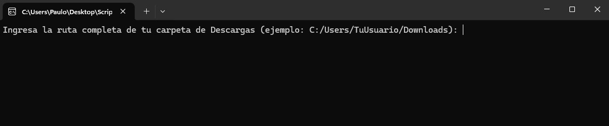
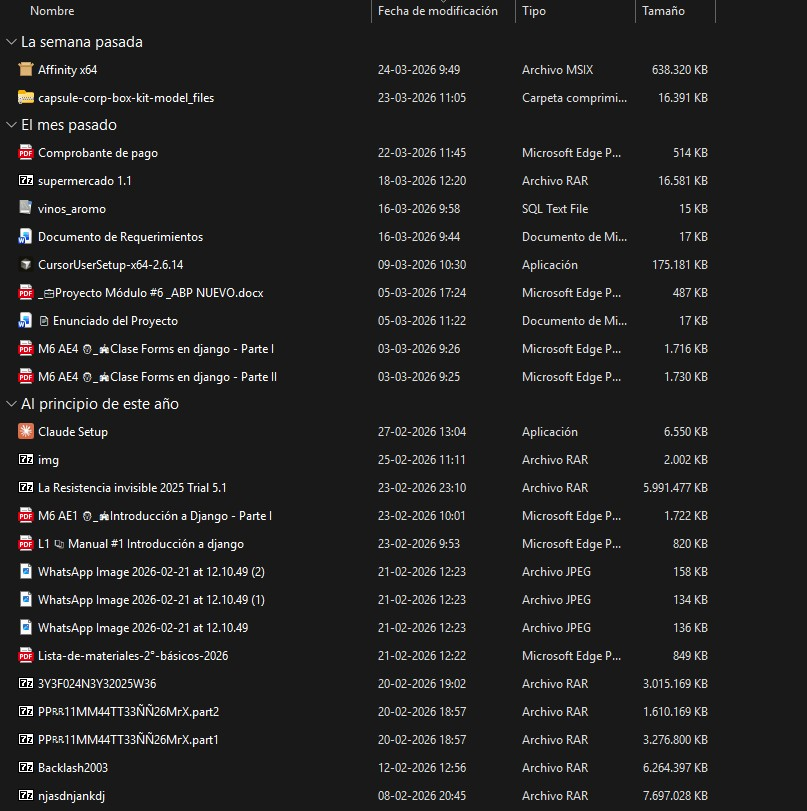
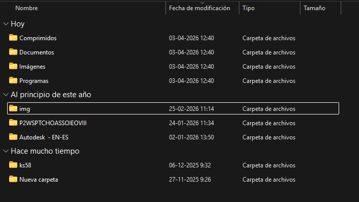
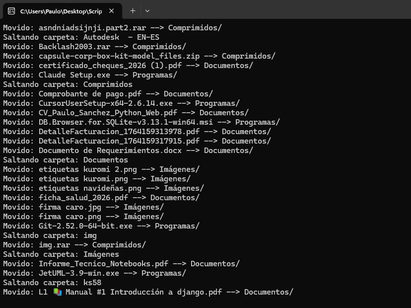

# 📂 Organizador de Descargas

## 📌 Descripción
Script en **Python** que organiza automáticamente los archivos de tu carpeta de Descargas.  
Clasifica los archivos por tipo (documentos, imágenes, música, videos, programas, comprimidos) y elimina duplicados, conservando siempre la versión más reciente.

## 🎯 Beneficio
- Mantiene tu carpeta de Descargas ordenada.  
- Elimina duplicados de forma segura usando **hash SHA-256**.  
- Renombra archivos para quitar sufijos molestos como "copia" o "(1)".  
- Crea carpetas por categoría y mueve los archivos automáticamente.  

---

## 🖼️ Ejemplo visual

### Ejecución


### Carpeta antes de organizar


### Carpeta después de organizar


### Mensajes en consola



## ⚙️ Tecnologías
- Python 3  
- Librerías estándar: `hashlib`, `pathlib`, `datetime`  

---

## 📂 Cómo usar
1. Clonar el repositorio o copiar el script.  
2. Ejecutar el script en consola:  
   ```bash
   python organizar_descargas.py
